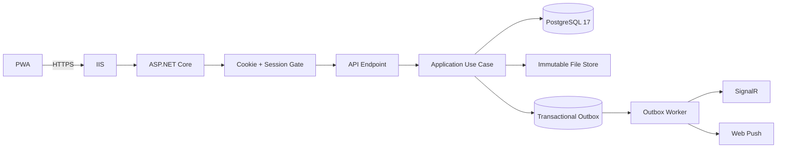

# 00 — Backend Architecture

## Architecture style

Build a **modular monolith**. This application has many domains, but a single production host is appropriate initially. Module boundaries must be strong enough to split later if necessary without starting with distributed-system complexity.

## Recommended solution structure

```text
src/
  SalesHub.Api/
  SalesHub.Application/
  SalesHub.Domain/
  SalesHub.Infrastructure/
  SalesHub.Contracts/
  SalesHub.Workers/

tests/
  SalesHub.UnitTests/
  SalesHub.IntegrationTests/
  SalesHub.AuthorizationTests/
  SalesHub.EndToEndContractTests/
```

### SalesHub.Api

Responsibilities:
- HTTP endpoints
- SignalR hubs
- auth cookie/session middleware
- antiforgery
- request validation entrypoint
- correlation ID
- exception -> ProblemDetails mapping
- health endpoints
- OpenAPI in nonproduction/authorized environments

Keep endpoints thin.

### SalesHub.Application

Use-case layer.

Examples:
- `CreateSale`
- `DeleteSameDaySale`
- `CorrectHistoricalSale`
- `SendChatMessage`
- `PublishAnnouncement`
- `ApproveTimeOff`
- `GrantTechnicalGrace`
- `CreateSensitiveExport`
- `RestoreLatestBackup`

Each use case:
1. authorizes against policy and target resource
2. validates business invariants
3. modifies state transactionally
4. writes audit where required
5. writes outbox events
6. commits
7. realtime/push happens asynchronously from the outbox

### SalesHub.Domain

Pure domain concepts:
- enums
- value objects
- aggregate business invariants
- record ID semantics
- business date/time rules
- no EF-specific infrastructure calls

### SalesHub.Infrastructure

- EF Core DbContext
- PostgreSQL mappings
- Identity store
- file/blob store
- Web Push adapter
- Dropbox backup adapter
- Data Protection configuration
- scheduled-job leasing
- outbox dispatcher
- search indexing
- export generation
- diagnostics

### SalesHub.Contracts

Stable request/response/event DTOs shared between API and frontend/generated TS client.

### SalesHub.Workers

Hosted services:
- outbox publisher
- notification delivery
- scheduled jobs
- backup worker
- cleanup/retention
- reminder worker
- search indexing
- health aggregation
- presence evaluation

These can initially run in the same process or a second Windows service. Prefer one deployment unit until load proves separation is needed.

## Main modules

1. Identity & Sessions
2. Directory & Profiles
3. Sales
4. Chat
5. Announcements
6. Tasks
7. Forms
8. Resources
9. Recognitions
10. Presence
11. Shifts & Time Off
12. Breaks
13. Technical Issues
14. Employee Management Records
15. Support
16. Notifications
17. Search
18. Reports & Archive
19. System Health / Sync Health
20. Feature Controls & Settings
21. Security & Audit
22. Backup / Recovery
23. Deployment Governance

## Request pipeline



## Why SignalR

SignalR is the realtime transport for:
- chat
- typing
- read receipts
- presence
- sales totals/leaderboards
- celebration events
- announcement progress
- task updates
- support updates
- approvals queue
- system/sync health
- force-refresh / remote-sync commands

Do not create separate custom WebSocket implementations for each feature.

## API versioning

Start with `/api/v1/...`.

Do not version SignalR hub path in ways that unnecessarily break clients; version event contracts inside DTO envelopes when needed.

## Source-of-truth rules

- PostgreSQL is source of truth for application state.
- Notification Center database rows are source of truth for notifications.
- SignalR and push are delivery mechanisms.
- Browser local cache is never authoritative.
- All money totals are computed from active canonical sale rows or maintained projections that can be rebuilt from canonical rows.
